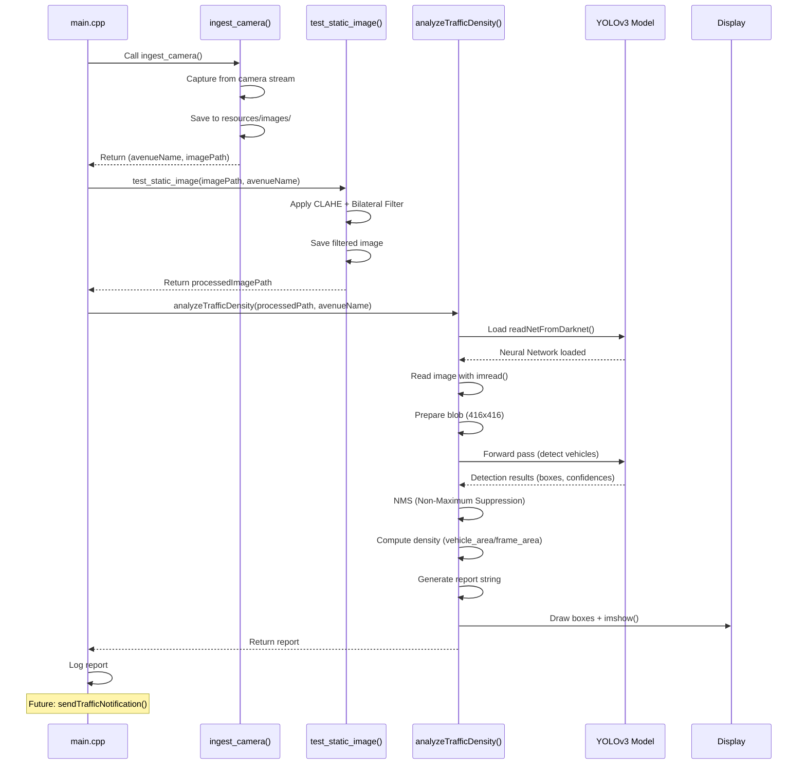
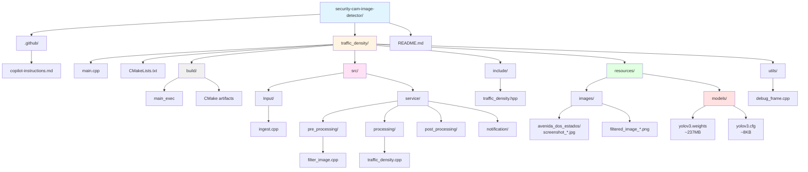
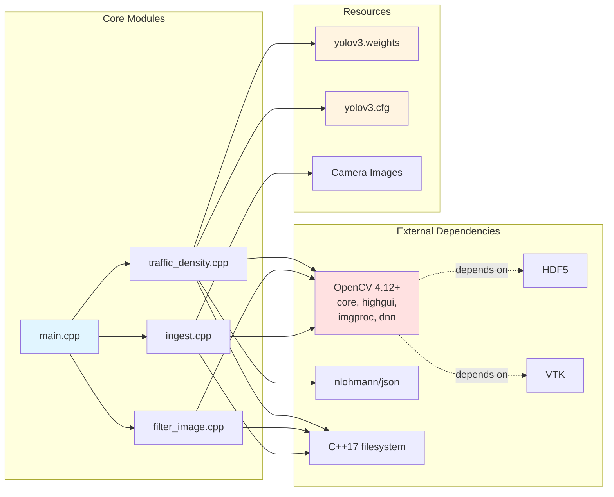
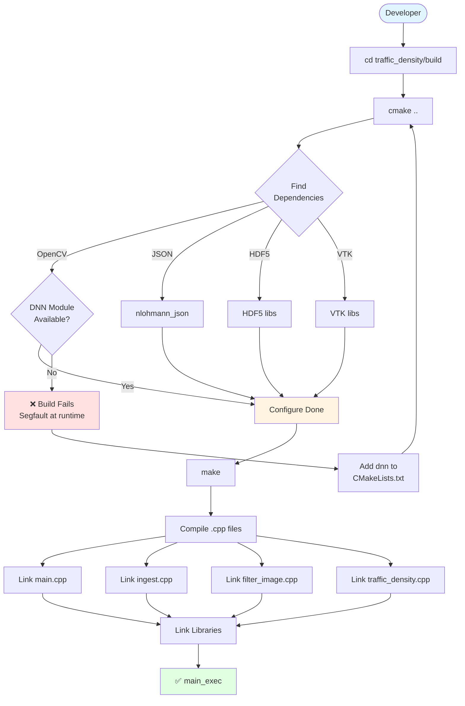

# Security Camera Image Detector - Architecture

## System Architecture

```mermaid
graph TB
    subgraph "Entry Point"
        Main[main.cpp<br/>Pipeline Orchestrator]
    end

    subgraph "Image Ingestion"
        Camera[Camera Stream<br/>Santo André, SP]
        IngestFunc[ingest_camera&#40;&#41;<br/>src/Input/ingest.cpp]
        CameraImages[(resources/images/<br/>avenida_dos_estados/)]
    end

    subgraph "Pre-Processing"
        PreProcess[test_static_image&#40;&#41;<br/>src/service/pre_processing/<br/>filter_image.cpp]
        CLAHE[CLAHE Enhancement]
        Bilateral[Bilateral Filter]
        ProcessedImages[(Filtered Images<br/>resources/images/)]
    end

    subgraph "Traffic Analysis"
        Analyze[analyzeTrafficDensity&#40;&#41;<br/>src/service/processing/<br/>traffic_density.cpp]
        YOLOModel[(YOLO Model<br/>resources/models/<br/>yolov3.weights<br/>yolov3.cfg)]
        DetectVehicles[Vehicle Detection<br/>OpenCV DNN]
        ComputeDensity[Density Calculation<br/>TrafficDensity Class]
    end

    subgraph "Output"
        Report[Traffic Report<br/>String Output]
        Display[OpenCV Display<br/>imshow&#40;&#41;]
        Notification[sendTrafficNotification<br/>&#40;future&#41;]
    end

    Camera -->|Video Stream| IngestFunc
    IngestFunc -->|Capture Frame| CameraImages
    IngestFunc -->|pair&#60;avenue, path&#62;| Main
    
    Main -->|imagePath, avenueName| PreProcess
    PreProcess -->|CLAHE| CLAHE
    CLAHE -->|Enhanced| Bilateral
    Bilateral -->|Filtered| ProcessedImages
    PreProcess -->|processedPath| Main
    
    Main -->|processedPath, avenueName| Analyze
    YOLOModel -->|Load Model| Analyze
    Analyze -->|readNetFromDarknet| DetectVehicles
    DetectVehicles -->|Bounding Boxes| ComputeDensity
    ComputeDensity -->|Density Metrics| Report
    
    Report --> Main
    Report -.->|Future| Notification
    Analyze -->|Annotated Image| Display

    style Main fill:#e1f5ff
    style IngestFunc fill:#fff4e1
    style PreProcess fill:#ffe1f5
    style Analyze fill:#e1ffe1
    style YOLOModel fill:#ffe1e1
```



## Data Flow



## Folder Structure



## Module Dependencies



## Build Process



## Key Patterns

### Function Signature Pattern
```cpp
// All processing functions follow this pattern:
std::string functionName(const std::string& imagePath, 
                         const std::string& avenueName);

// Ingestion returns structured data:
std::pair<std::string, std::string> ingest_camera();
// Returns: {avenueName, imagePath}
```

### Error Handling Pattern
```cpp
// Always check file existence
if (!std::filesystem::exists(path)) {
    std::cerr << "File not found: " << path << std::endl;
    return "Error: ...";
}

// Always validate cv::Mat
cv::Mat image = cv::imread(path);
if (image.empty()) {
    std::cerr << "Failed to load image: " << path << std::endl;
    return "Error: ...";
}
```

### Model Loading Pattern
```cpp
// ✅ CORRECT - Use Darknet-specific loader
cv::dnn::Net net = cv::dnn::readNetFromDarknet(configPath, weightsPath);

// ❌ WRONG - Generic loader causes segfault
// cv::dnn::Net net = cv::dnn::readNet(weightsPath, configPath);
```
